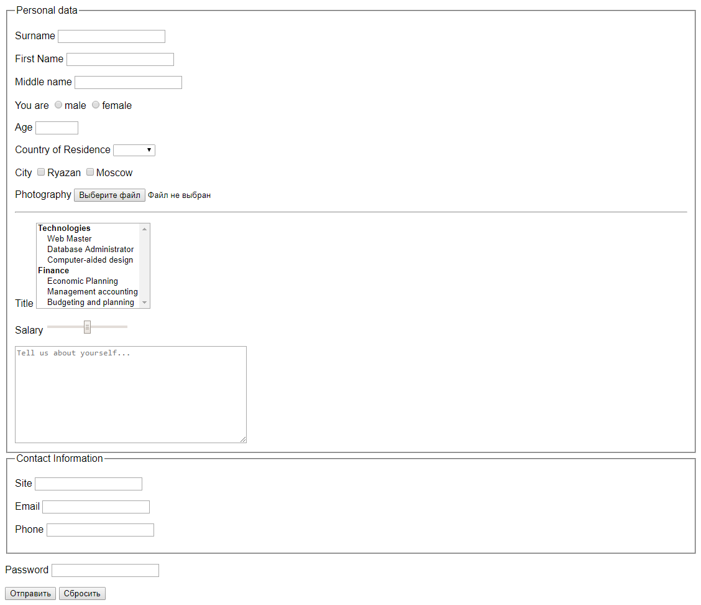

# Практическая работа 10 - Основы HTML и CSS. Часть 2.

## Задание 1

Сделайте какую-либо картинку круглой. Затем измените ее форму на более сложную, как в [примере](https://codepen.io/GeoffreyCrofte/pen/Hizkh).

## Задание 2

Создайте HTML-страницу с формой, используя типы для инпутов.

-   Поле "Country of Residence" должно быть выпадающим списком

-   Возраст должен быть в диапазоне от 18 до 101

-   Пароль должен быть обязателен для заполнения

-   Используйте валидацию браузером

-   Попробуйте и `GET`, и `POST` методы

-   Используйте `http://httpbin.org/` в качестве конечной точки (Для метода `GET` `http://httpbin.org/get`, а для `POST` `http://httpbin.org/post`)

[Построение форм](https://webref.ru/layout/learn-html-css/building-forms).

[HTML5-формы](https://html5book.ru/html5-forms/).

## Задание 3

Создайте таблицу.

-   Обратите внимание на шрифт

-   Строки должны иметь эффект при наведении на них

-   Весь контент в HTML должен быть в нижнем регистре

-   Выполните задание, используя селекторы по ID и классы

-   Используйте несколько CSS-файлов, назвать можно task-03-1.css, task-03-2.css
 
 Макет:

####Критерии оценки: 
0 - задания не выполнены
1-3 - задания выполнены, но есть существенные недоработки
4 - выполнены все задания, но есть небольшие несоответствия макетам (з.2-3)
5 - задания выполнены, соответствуют макетами(з.2-3) и исправлены комментарии тренера, если имеются